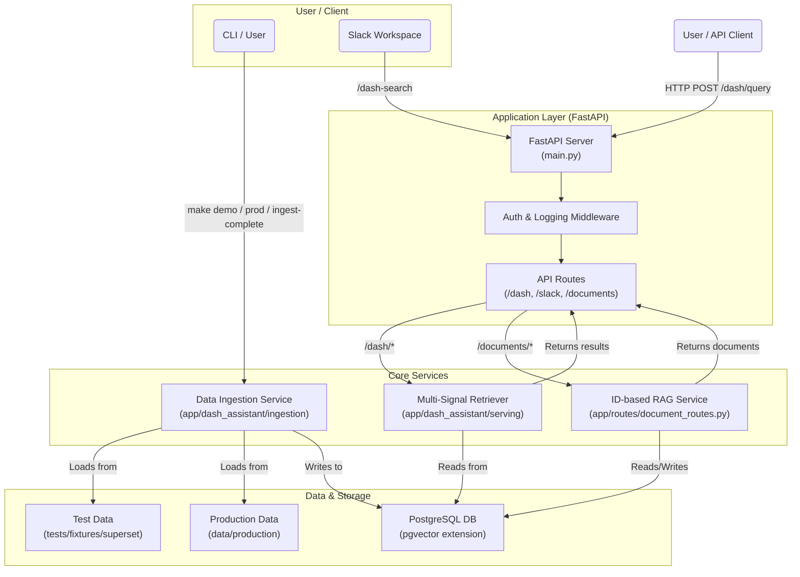

# RAG API & Dash Assistant

This project provides a robust, scalable API for Retrieval-Augmented Generation (RAG) tasks, built with FastAPI, LangChain, and PostgreSQL with the `pgvector` extension. It includes a specialized "Dash Assistant" for semantic search over BI dashboards and charts.

The codebase is designed to be primarily developed and maintained by an LLM agent (Cursor), with clear, concise documentation and a streamlined development environment.

## Architecture

The system is composed of two main features (ID-based RAG and Dash Assistant) sharing a common infrastructure. Data ingestion is handled via CLI scripts, while querying is exposed through a FastAPI server.



## 🚀 Getting Started

This project uses Docker for environment management and `make` for common commands.

### Prerequisites
- Docker & Docker Compose
- `make` installed

### 1. Quick Demo

The fastest way to see the system in action is to run the demo. It uses sample data and mock embeddings, requiring no external API keys.

```bash
# Start the demo stack, ingest sample data, and run health checks
make demo
```
Once complete, the API will be available:
- **Swagger UI**: [http://localhost:8000/docs](http://localhost:8000/docs)
- **Health Check**: [http://localhost:8000/dash/health](http://localhost:8000/dash/health)

### 2. Production Mode

When you're ready to use your own data and connect to real embedding providers (like OpenAI).

```bash
# 1. Add your data to the `data/production/` directory.
# You can copy the sample data as a template:
cp -R tests/fixtures/superset/* data/production/

# 2. Create and configure your environment file.
# Copy the example and add your secrets (e.g., OpenAI API Key).
cp dash_assistant.env.example .env

# 3. Run the production startup script.
# This will guide you through the setup process.
make prod
```

### 3. Development

For active development, you can start the database separately and run the API locally or in a fast-reloading container.

```bash
# Start just the database
make docker-db

# Run database migrations
make migrate

# (Optional) Load sample data for testing
make ingest-complete

# Run the FastAPI server with auto-reload
uvicorn main:app --reload --host 0.0.0.0 --port 8000
```

## Key Features

- **Dual RAG Systems**:
    1.  **ID-based Document RAG**: For general document retrieval, compatible with systems like LibreChat.
    2.  **Dash Assistant**: A specialized search system for BI dashboards using multi-signal retrieval (semantic, full-text, trigram) with Reciprocal Rank Fusion (RRF) to combine results.
- **Dockerized Environment**: Consistent and reproducible setup for development and production.
- **Makefile Interface**: Simplified commands for all common tasks (`make demo`, `make prod`, `make test-all`, `make lint`).
- **Slack Integration**: Includes a ready-to-use Slack bot with slash commands (`/dash-search`) and interactive feedback buttons.
- **Automated Migrations**: SQL-based migration system for evolving the database schema safely.
- **CI/CD Ready**: GitHub Actions workflow for automated testing, linting, and security scanning.

## Configuration

Application settings are managed via environment variables, loaded by Pydantic.
- A `dash_assistant.env.example` file is provided as a template. Copy it to `.env` for local development.
- **`DEMO_MODE`**: Set to `true` to disable authentication and use mock embeddings. This is the default for `make demo`.
- **`EMBEDDINGS_PROVIDER`**: Switches between `MOCK` and `OPENAI`.
- **`POSTGRES_*`**: Standard PostgreSQL connection settings.
- **`JWT_SECRET`**: A secret key to enable JWT authentication on API endpoints (disabled in demo mode).

## For LLM Agents

A detailed, technical "cheat sheet" for LLM development is available in `instructions.md`. It contains concise information on module structure, data flows, and development conventions.

